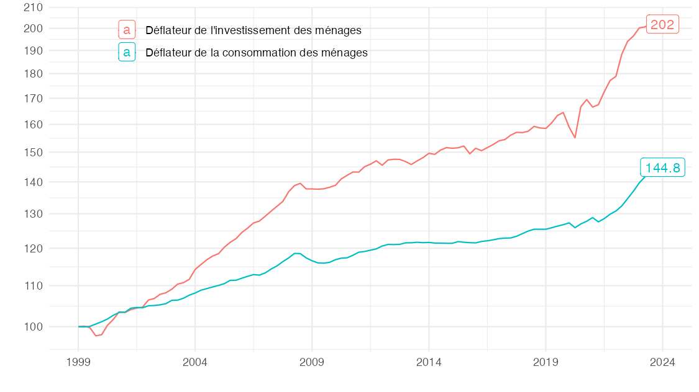

# Mesurer le pouvoir d'achat

Ce dépôt met à disposition des codes de réplication pour le [document de travail en lien](https://fgeerolf.com/mesurer-le-pouvoir-d-achat.pdf).

## Réplication

Le dépôt contient de quoi répliquer les figures et les données du [document de travail en lien](https://fgeerolf.com/mesurer-le-pouvoir-d-achat.pdf):

### Figure 1: IPC, IPCH et déflateur de la consommation

[Code R](figure1.R)

### Figure A1 : Poids de l’enseignement dans l’IPC et dans l’IPCH.

[Code R](figureA1.R)

