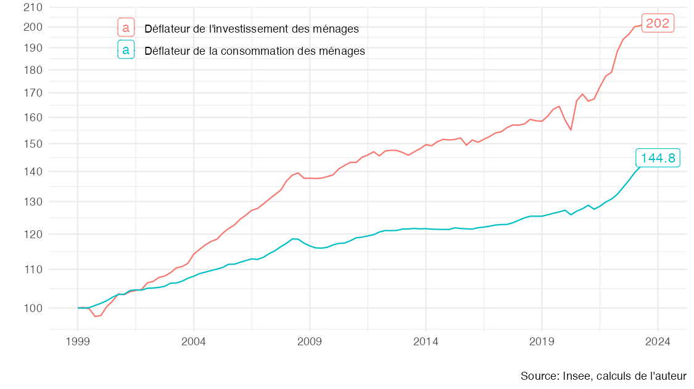
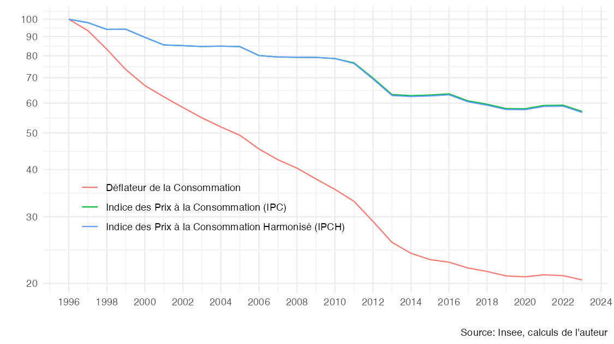
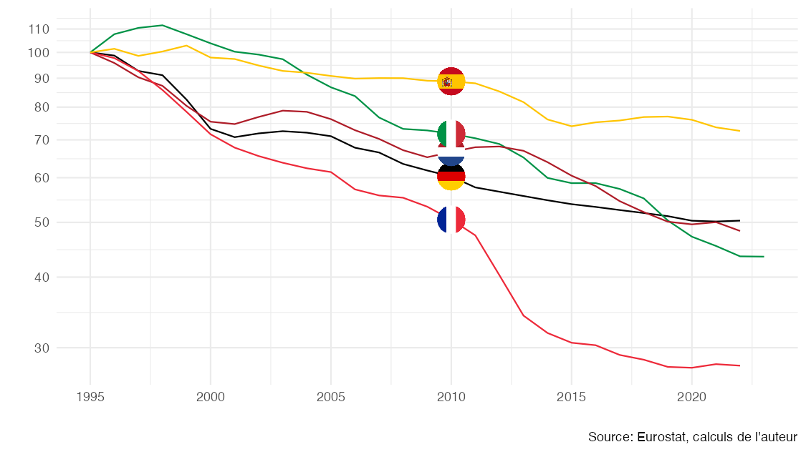
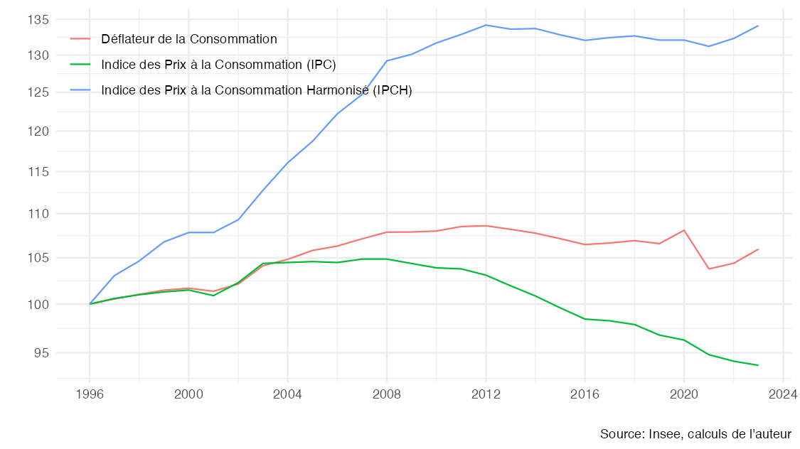
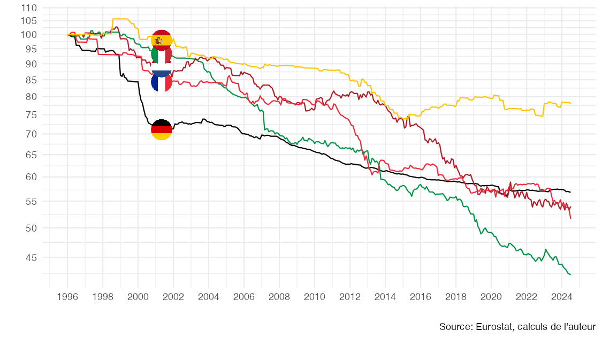
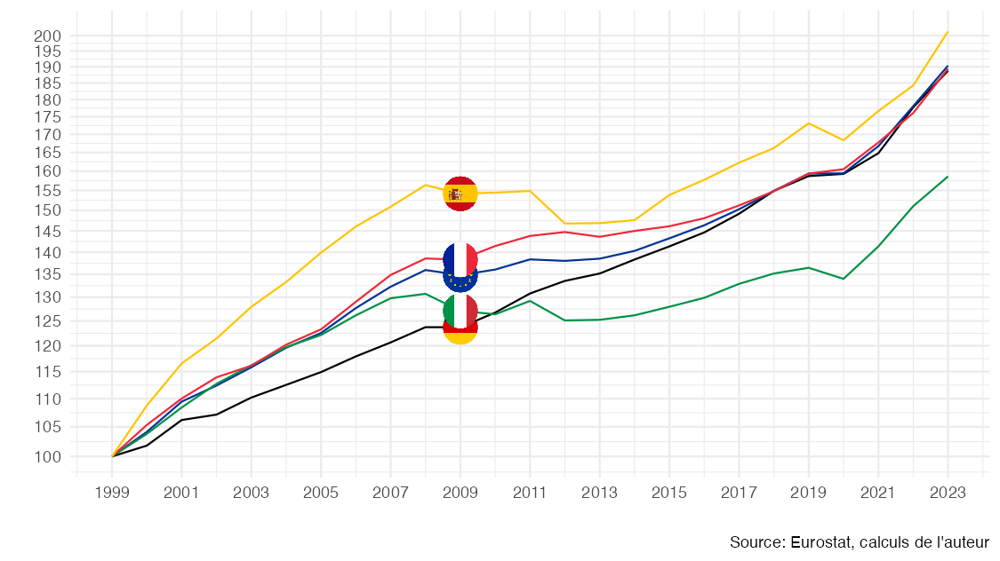
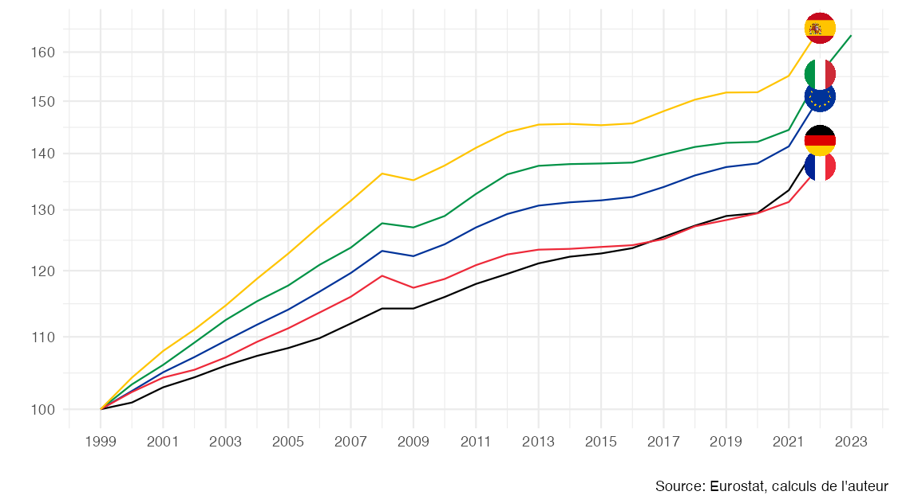
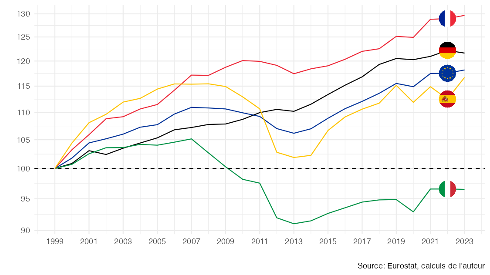

# Mesurer le pouvoir d'achat

Date de publication: 9 juillet 2024.

Ce dépôt met à disposition des codes de réplication pour le [document de travail en lien](https://fgeerolf.com/mesurer-le-pouvoir-d-achat.html).

  <!-- Reader Navigation -->
  **[📖 Lire en ligne](https://fgeerolf.com/mesurer-le-pouvoir-d-achat.html)** •
  **[📄 Version PDF](https://fgeerolf.com/mesurer-le-pouvoir-d-achat.pdf)** •
  **[🌐 Présentation HTML](https://fgeerolf.com/mesurer-le-pouvoir-d-achat-handouts.html)**•
  **[📓 Présentation PDF](https://fgeerolf.com/mesurer-le-pouvoir-d-achat-slides.pdf)** 

## Réplication

Le dépôt contient de quoi répliquer les figures et les données du [document de travail en lien](https://fgeerolf.com/mesurer-le-pouvoir-d-achat.html):

### Figure 1: Déflateur de la consommation et de l’investissement des ménages, Base 100 = 1999

[Code R](R/figure1.R)

### Figure 2: Déflateur de la consommation vs. IPCH et IPC, COICOP 08 - Communications, Base 100 = 1996

[Code R](R/figure2.R)

### Figure 3: Déflateur de la consommation pour le COICOP 08, Base 100 = 1995

[Code R](R/figure3.R)

### Figure 4: Déflateur vs. IPCH et IPC pour la santé (COICOP 06), Base 100 = 1996

[Code R](R/figure4.R)

### Figure 5: IPCH pour la communication (COICOP 08), Base 100 = 1996

[Code R](R/figure5.R)

### Figure 6: Revenu disponible brut par habitant, nominal (en €), Base 100 = 1999

[Code R](R/figure6.R)

### Figure 7: Déflateur de la consommation, Base 100 = 1999

[Code R](R/figure7.R)

### Figure 9: Revenu disponible brut par habitant déflaté par le « déflateur de la consommation », Base 100 = 1999

[Code R](R/figure9.R)

